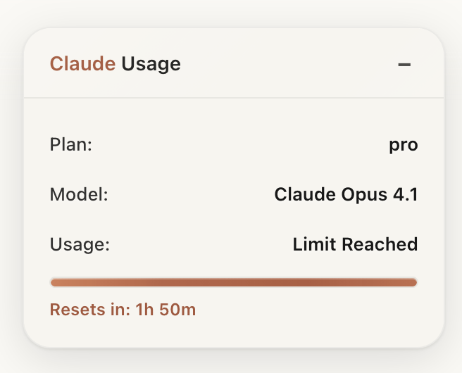

## English

Claude Usage Monitor for browsers. Track your Claude web usage with a floating panel and popup. Countdown strictly follows the official reset time displayed by Claude (e.g., "resets 1:00 PM").

- Real‑time monitoring and progress bar
- Floating panel (draggable, collapsible)
- Official-only limit timer: uses absolute time like "1:00 PM" first; falls back to "Resets in Xh Ym" only if no absolute time is present; never guesses
- Data persistence; auto-clear when reset time arrives or sending becomes available again

Install (Developer Mode):
1) Load the extension folder claude-usage-monitor as an unpacked extension
2) Open claude.ai and you will see the panel in the top-right corner

Notes:
- The timer is hidden unless an official reset time is parsed
- Minutes are rounded up (ceil), so +/-1 minute display differences are expected

---
### Quick install (Out-of-the-box)

- Option 1 — Download the ready-made zip and load it as an unpacked extension:
  1) Download dist/claude-usage-monitor.zip
  2) Unzip it
  3) In Chrome/Edge: Extensions → Developer mode → Load unpacked → select the unzipped claude-usage-monitor folder
  4) In Firefox/Zen: about:debugging → This Firefox → Load Temporary Add-on → select manifest.json in that folder

- Option 2 — Build locally with a one-liner:
  1) Run scripts/pack.sh
  2) It will generate dist/claude-usage-monitor.zip for you to load as above


## English (Detailed)

### Features

> Important: The countdown strictly follows the official time shown by Claude (e.g., "resets 1:00 PM"). The timer appears only when an official time is present; we never assume a fixed window.

- Real‑time monitoring of sent messages
- Beautiful floating panel with progress bar
- Clear usage percentage and bar fill
- Smart notice when you approach the limit
- Theme aware (light/dark)
- Responsive layout
- Persistent storage of usage data
- Automatic daily reset for day-based counters

### Installation

#### 1. Prepare files

```
claude-usage-monitor/
├── manifest.json      # Extension manifest
├── content.js         # Content script
├── background.js      # Background script
├── popup.html         # Popup UI
├── popup.js           # Popup logic
├── styles.css         # Styles
└── icons/             # Icons
    ├── icon16.png
    ├── icon32.png
    ├── icon48.png
    └── icon128.png
```

#### 2. Icons
- Create your own icons, or use an online generator such as favicon.io

#### 3. Load in Zen/Firefox
1. Open Zen/Firefox
2. Visit `about:debugging`
3. Click "This Firefox"
4. Click "Load Temporary Add-on"
5. Select `manifest.json` inside the folder

#### 4. Verify
1. Open https://claude.ai
2. After a few seconds, the floating panel should appear in the top‑right
3. Click the extension icon to open the popup panel

### Usage

- Drag the title bar to move the panel
- Click `−` / `+` to collapse/expand
- Counters update after each message is sent

Popup shows:
- Today’s message count
- Usage percentage estimated from the detected plan
- Plan info (auto‑detected)
- Manual refresh button
- Reset counter button (with confirmation)

### Plan detection
- Claude Free — limited messages
- Claude Pro — about 45 messages / 5 hours (subject to official changes)
- Claude Max — about 200+ messages / 5 hours

### Advanced configuration

#### Custom limit
If plan detection is off for your account, you can set a custom limit:

```javascript
// Example: set a custom limit to 100 messages
this.usageData.dailyLimit = 100;
```

#### Change reset baseline
Default behavior resets at midnight for day‑based counters; adjust logic in `background.js` if needed (see `getNextMidnight()`).

### Troubleshooting

- Panel not visible
  1) Ensure you are on claude.ai
  2) Check the browser console for errors
  3) Refresh the page

- Inaccurate counts
  1) Click Refresh
  2) Avoid multiple Claude tabs sending simultaneously
  3) Reset the counter

- Permissions
  1) Ensure the extension has access to claude.ai
  2) Re‑load the extension

### Development notes
- WebExtensions API (Manifest V3)
- JavaScript (ES6+), CSS3

Key pieces:
1) Content Script (`content.js`) — observes DOM, detects sends, parses limit info
2) Background Script (`background.js`) — storage and scheduling
3) Popup UI (`popup.html/js`) — visualization and interaction

### Data schema (storage)

```javascript
{
  messagesCount: 0,        // message count
  tokensUsed: 0,           // token usage (TBD)
  lastResetTime: "date",   // last daily reset timestamp
  planType: "pro",         // plan type
  dailyLimit: 45,          // daily limit baseline
  currentUsagePercent: 0   // computed usage percentage
}
```

### Changelog (Highlights)
- v0.1.0 — Official reset‑time countdown, OOTB zip, bilingual README, removed test button

### License
MIT License

### Disclaimer
This is not an official Anthropic product. Usage estimates are inferred from the web UI. Always rely on Claude’s own official indicators.


## 开箱即用（Out-of-the-box）

- 方式一：下载现成压缩包并加载
  1）下载 dist/claude-usage-monitor.zip 并解压
  2）Chrome/Edge：扩展程序 → 开发者模式 → 加载已解压的扩展程序 → 选择解压后的 claude-usage-monitor 目录
  3）Firefox/Zen：about:debugging → This Firefox → Load Temporary Add-on → 选择该目录下的 manifest.json

- 方式二：本地一键打包
  1）运行 scripts/pack.sh
  2）脚本会生成 dist/claude-usage-monitor.zip，按方式一的步骤加载


# Claude Usage Monitor for Zen Browser

一个专为Zen Browser设计的Claude AI用量监控插件，帮助你实时跟踪Claude网页版的使用情况。

## 功能特点

> 重要说明：倒计时严格以 Claude 官方界面显示为准（例如 “resets 1:00 PM”）。当且仅当解析到官方的重置时间时才显示；若页面没有给出明确时间，则不显示倒计时，不再使用任何固定 +5 小时的假设。


- 🔥 **实时监控** - 自动跟踪Claude消息发送数量
- 📊 **可视化界面** - 美观的悬浮窗口显示用量信息
- 📈 **进度条显示** - 直观的用量百分比和进度条
- 🔔 **智能提醒** - 接近限制时自动提醒
- 🎨 **主题适配** - 支持浅色/深色主题自动切换
- 📱 **响应式设计** - 适配不同屏幕尺寸
- 💾 **数据持久化** - 自动保存用量数据
- 🔄 **每日重置** - 自动重置每日用量计数

## 安装步骤

### 1. 准备文件

创建一个新文件夹 `claude-usage-monitor`，将以下文件保存到该文件夹：

```
claude-usage-monitor/
├── manifest.json      # 插件清单文件
├── content.js         # 内容脚本
├── background.js      # 后台脚本
├── popup.html         # 弹窗页面
├── popup.js          # 弹窗脚本
├── styles.css        # 样式文件
└── icons/            # 图标文件夹
    ├── icon16.png
    ├── icon32.png
    ├── icon48.png
    └── icon128.png
```

### 2. 创建图标

在 `icons` 文件夹中创建不同尺寸的图标文件，或使用在线图标生成器：

- **简单方案**: 使用任意图标编辑软件创建紫色渐变的"C"字图标
- **在线生成**: 使用 [favicon.io](https://favicon.io) 等在线工具

### 3. 在Zen Browser中加载

1. 打开Zen Browser
2. 在地址栏输入 `about:debugging`
3. 点击"This Firefox"
4. 点击"Load Temporary Add-on"
5. 选择插件文件夹中的 `manifest.json` 文件
6. 插件将自动加载并出现在扩展列表中

### 4. 验证安装

1. 访问 [claude.ai](https://claude.ai)
2. 等待几秒钟，页面右上角应该出现用量监控悬浮窗
3. 点击Zen Browser工具栏中的插件图标，查看详细统计

## 使用说明

### 悬浮窗功能

- **拖拽移动**: 点击标题栏可拖拽移动位置
- **折叠展开**: 点击 `−` / `+` 按钮折叠或展开详情
- **实时更新**: 发送消息后自动更新计数

### 弹窗面板

点击插件图标打开详细面板：

- **今日消息数**: 当前已发送的消息数量
- **使用百分比**: 基于检测到的计划限制计算的使用率
- **计划信息**: 自动检测的Claude订阅计划
- **刷新按钮**: 手动刷新用量数据
- **重置按钮**: 重置当日计数（需确认）

### 计划检测

插件会自动检测以下Claude计划类型：

- **Claude Free**: 免费计划，有限消息数
- **Claude Pro**: 专业计划，约45条消息/5小时
- **Claude Max**: 最高计划，约200+条消息/5小时

## 高级配置

### 自定义限制

如果插件无法正确检测你的计划，可以手动修改：

1. 打开 `content.js` 文件
2. 找到 `detectPlanType()` 函数
3. 修改 `dailyLimit` 值为你的实际限制

```javascript
// 例如：设置自定义限制为100条消息
this.usageData.dailyLimit = 100;
```

### 修改重置时间

默认在午夜重置，可以修改重置时间：

1. 打开 `background.js` 文件
2. 找到 `getNextMidnight()` 函数
3. 修改重置时间逻辑

## 故障排除

### 插件不显示

1. 确认已访问 claude.ai 网站
2. 检查浏览器控制台是否有错误信息
3. 尝试刷新页面

### 计数不准确

1. 点击"刷新"按钮更新数据
2. 检查是否有多个Claude标签页同时打开
3. 重置计数器重新开始统计

### 权限问题

1. 确保插件有访问 claude.ai 的权限
2. 检查Zen Browser的扩展设置
3. 重新加载插件

## 开发说明

### 技术栈

- **WebExtensions API** - 跨浏览器扩展标准
- **Manifest V3** - 最新的扩展清单版本
- **JavaScript ES6+** - 现代JavaScript特性
- **CSS3** - 现代样式和动画

### 关键组件

1. **Content Script** (`content.js`)
   - 监控页面DOM变化
   - 检测消息发送事件
   - 解析用量限制信息

2. **Background Script** (`background.js`)
   - 管理数据存储
   - 处理定时任务
   - 发送通知提醒

3. **Popup Interface** (`popup.html/js`)
   - 用户界面展示
   - 数据可视化
   - 用户交互处理

### 数据存储

插件使用Chrome Storage API存储数据：

```javascript
{
  messagesCount: 0,        // 消息计数
  tokensUsed: 0,          // 令牌使用量（待实现）
  lastResetTime: "date",   // 上次重置时间
  planType: "pro",        // 计划类型
  dailyLimit: 45,         // 每日限制
  currentUsagePercent: 0   // 当前使用百分比
}
```

## 更新日志

### v1.0.0 (初始版本)
- ✅ 基本用量监控功能
- ✅ 悬浮窗显示界面
- ✅ 计划类型自动检测
- ✅ 进度条和百分比显示
- ✅ 每日自动重置
- ✅ 主题自适应

### 计划功能 (v1.1.0)
- 🔄 令牌级别的用量跟踪
- 🔄 更精确的限制检测
- 🔄 历史用量统计
- 🔄 导出用量报告
- 🔄 自定义提醒阈值

## 贡献

欢迎提交Issue和Pull Request来改进这个插件！

## 许可证

MIT License - 可以自由使用、修改和分发。

## 免责声明

此插件非Anthropic官方产品，仅用于个人用量跟踪。用量数据基于页面行为推测，可能不完全准确。请以Claude官方显示的用量信息为准。